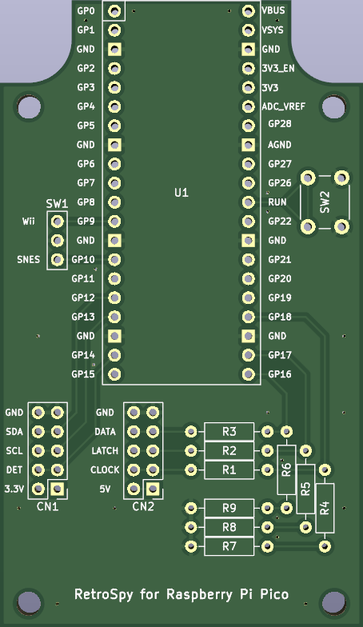

[English README is here](README-RaspberryPiPico.md)

# RetroSpy for Raspberry Pi Pico

以下のコントローラーをRaspberry Pi Picoで使えるように、RetroSpyを改造したものです。 
(動作確認はスーファミ実機とミニスーファミでのみ行っています。)

- SNES
- Nintendo Wii
- Nintendo NES Classic
- Nintendo SNES Classic

## ハードウェアの作り方

### 基板の発注

#### JLCPCBで、オーダー番号を目立たない場所に印字したい場合

gerber_JLCPCB.zip をアップロードし、「Remove Order Number」から「Specify a location」を選択してください。

#### JLCPCBで、オーダー番号を印字したくない場合

gerber.zip をアップロードし、「Remove Order Number」から「Yes」を選択してください。 
但し、Yesを選択するとオプション料金がかかります。

#### JLCPCB以外の場合

gerber.zip をアップロードしてください。

### ケースの選定

基板は以下のケースを想定して設計されています。

* タカチ電機工業製 PR-105B
* タカチ電機工業製 PR-105G
* テイシン電機製 TB-32-B
* テイシン電機製 TB-32-IV

USBコネクタ、トグルスイッチ、コントローラーのケーブル用の穴をあけてください。

### 組み立て

* U1にソケットを半田付けし、Raspberry Pi Picoを取り付けてください。
* R1～R9に10kΩの抵抗を半田付けしてください。
* SW1にトグルスイッチを接続するか、ジャンパピンを半田付けしてください。 
  (SW1は、どちらのコントローラを読み取るかを選択するために使用します。)
* SW2にリセットスイッチを付けることができますが、無くても問題ありません。
* Wii用の延長ケーブルを半分に切り、CN1に接続してください。
* スーパーファミコン用の延長ケーブルを半分に切り、CN2に接続してください。
* Raspberry Pi PicoのBOOTSELボタンを押しながらUSBケーブルを接続し、firmware.ino.sf2を書き込んでください。

## ファームウェアを改造する場合

### ファームウェアのビルド手順

1. Arduino IDEをインストール
2. firmware.inoを開く
3. 「File」→「Preferences...」をクリック
4. 「Additional boards manager URLs」欄に以下のURLをコピペし、「OK」をクリック 
   `https://github.com/earlephilhower/arduino-pico/releases/download/global/package_rp2040_index.json`
5. 「Tools」→「Board」→「Board Manager...」をクリック
6. 検索欄に「pico」と入力し、「Raspberry Pi Pico/RP2040 by Earle F. Philhower, III」をインストール
7. 「Tools」→「Board」→「Raspberry Pi Pico/RP2040」→「Raspberry Pi Pico」をクリック
8. 「Tools」→「CPU Speed」→「200 MHz (Overclock)」をクリック
9. 「Tools」→「Optimize」→「Fast (-Ofast) (maybe slower)」をクリック
10. 「Tools」→「USB Stack」→「Pico SDK」をクリック
11. 「Sketch」→「Export Compiled Binary」をクリック
