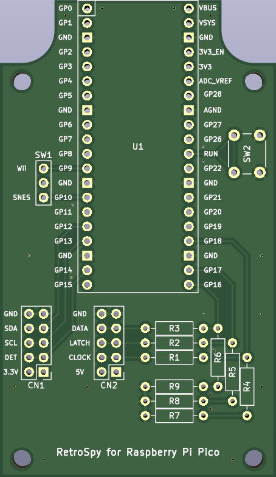
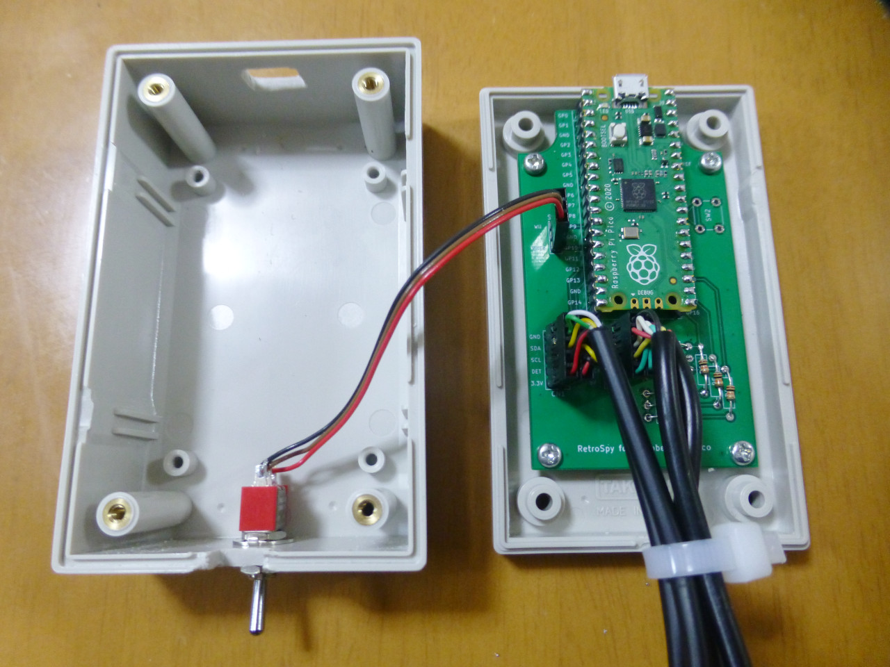

[日本語版 README はこちら](README-RaspberryPiPico-ja.md)

# RetroSpy for Raspberry Pi Pico

This is a RetroSpy modification to allow the following controllers to be used with Raspberry Pi Pico. 
(Operation has been tested only with SNES and SNES Classic.)

- SNES
- Nintendo Wii
- Nintendo NES Classic
- Nintendo SNES Classic

## How to Build Hardware

### Ordering PCBs

#### If you place an order with JLCPCB and want the order number printed in an inconspicuous location

Upload gerber_JLCPCB.zip and select "Specify a location" from the "Remove Order Number" options.

#### If you place an order with JLCPCB and do not want the order number printed

Upload gerber.zip and select "Yes" from the "Remove Order Number" options. 
However, if Yes is selected, an optional fee will be charged.

#### For orders outside of JLCPCB

Upload gerber.zip.

### Selection of Case

The PCB is designed for the following cases.

* PR-105B manufactured by TAKACHI ELECTRONICS ENCLOSURE
* PR-105G manufactured by TAKACHI ELECTRONICS ENCLOSURE
* TB-32-B manufactured by Teishin Electric
* TB-32-IV manufactured by Teishin Electric

Make holes for USB connector, toggle switch, and controller cables.

### Assembly

* Solder sockets to U1 and mount a Raspberry Pi Pico.
* Solder 10kΩ resistors to R1 to R9.
* Connect a toggle switch or solder a jumper pin to SW1. 
  (SW1 is used to select which controller to read.)
* A reset switch can be attached to SW2, but there is no problem even without it.
* Cut the extension cable for Wii in half and connect to CN1.
* Cut the extension cable for SNES in half and connect to CN2.
* While pressing the BOOTSEL button on the Raspberry Pi Pico, connect the USB cable and write the firmware.ino.uf2.

## If you modify firmware

### How to Build Firmware

1. Install Arduino IDE
2. Open firmware.ino
3. Click "File", then "Preferences..."
4. Copy and paste the following URL into the "Additional boards manager URLs" field and click "OK" 
   `https://github.com/earlephilhower/arduino-pico/releases/download/global/package_rp2040_index.json`
5. Click "Tools", "Board", then "Board Manager..."
6. Type "pico" in the search field and install "Raspberry Pi Pico/RP2040 by Earle F. Philhower, III"
7. Click "Tools", "Board", "Raspberry Pi Pico/RP2040", then "Raspberry Pi Pico"
8. Clock "Tools", "CPU Speed", then "200 MHz (Overclock)"
9. Click "Tools", "Optimize", then "Fast (-Ofast) (maybe slower)"
10. Click "Tools", "USB Stack", then "Pico SDK"
11. Click "Sketch", then "Export Compiled Binary"
